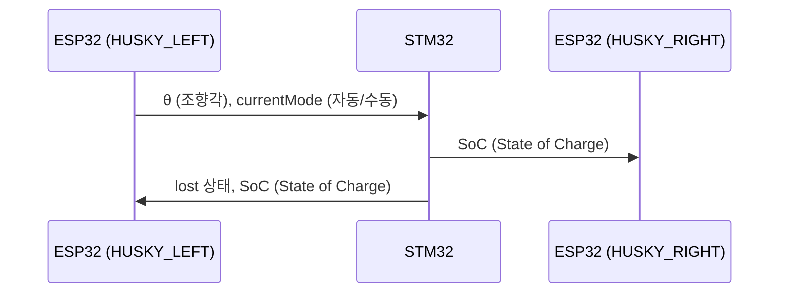

# Patent-Recognition

##### 환자 추종 스마트 링거 폴대의 환자인식 기능을 담당하는 레포지토리입니다. 

_AI 카메라를 통해 환자에게 부착된 **april tag**를 인식 후, 해당 factor를 메인 MCU에 송신하고 배터리, Lost 상황 등을 메인 MCU로 부터 수신하여 병원 서버에 올리는 역할을 한다._

본 레포지토리는 **2025년 한국공학대학교 종합설계 (캡스톤디자인) 프로젝트**와 **한이음 프로젝트**의 지원을 받아 개발되고 있습니다.

---
## ✅ 현재까지 구현된 기능

### 🔍 1. HUSKYLENS 기반 태그 인식 (Tag Recognition)

- HUSKYLENS의 태그 인식 기능을 활용하여 환자의 좌/우 위치를 판별

- 해당 위치 정보를 STM32로 송신하여 제어에 활용

### 🧭 2. 2개의 HUSKYLENS를 통한 조향각 매핑

- 단일 HUSKYLENS의 시야각 한계를 극복하기 위해 좌우에 각각 1개씩 총 2개 사용

- 두 센서의 데이터를 조합하여 조향각 −70 < θ < 70 범위로 매핑

### 🌐 3. STM32로부터 수신한 주요 상태 서버 송신
- STM32로부터 수신한 데이터 패킷(lost 상황, 자동/수동 모드)을 AWS 서버로 전송

- NodeRed연동된 스마트 웨어러블 기기와 실시간으로 통신하여 경고 알림 제공

### 🔄 4. 자동 / 수동 모드 전환 기능
- 링거 폴대 하부의 버튼 입력을 통해 자동 ↔ 수동 모드 전환 가능

---
## Data Flow

## 프로젝트 파일 구조
'''

'''
---

## 설치 및 실행 방법

### 1. HUSKYLENS 펌웨어
 1) Arduino IDE 설치
 2) `

