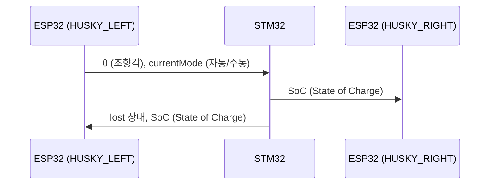

# Patent-Recognition

##### 환자 추종 스마트 링거 폴대의 환자인식 기능을 담당하는 레포지토리입니다. 

_AI 카메라를 통해 환자에게 부착된 **april tag**를 인식 후, 해당 factor를 메인 MCU에 송신하고 배터리, Lost 상황 등을 메인 MCU로 부터 수신하여 병원 서버에 올리는 역할을 한다._

본 레포지토리는 **2025년 한국공학대학교 종합설계 (캡스톤디자인) 프로젝트**와 **한이음 프로젝트**의 지원을 받아 개발되고 있습니다.

---
### ✅ 현재까지 구현된 기능

#### 🔍 1. HUSKYLENS 기반 태그 인식 (Tag Recognition)

- HUSKYLENS의 태그 인식 기능을 활용하여 환자의 좌/우 위치를 판별

- 해당 위치 정보를 STM32로 송신하여 제어에 활용

#### 🧭 2. 2개의 HUSKYLENS를 통한 조향각 매핑

- 단일 HUSKYLENS의 시야각 한계를 극복하기 위해 좌우에 각각 1개씩 총 2개 사용

- 두 센서의 데이터를 조합하여 조향각 −70 < θ < 70 범위로 매핑

#### 🌐 3. STM32로부터 수신한 주요 상태 서버 송신
- STM32로부터 수신한 데이터 패킷(lost 상황, 자동/수동 모드)을 AWS 서버로 전송

- NodeRed연동된 스마트 웨어러블 기기와 실시간으로 통신하여 경고 알림 제공

#### 🔄 4. 자동 / 수동 모드 전환 기능
- 링거 폴대 하부의 버튼 입력을 통해 자동 ↔ 수동 모드 전환 가능

---
## Data Flow

## 프로젝트 파일 구조

'''

'''
---

## 설치 및 실행 방법

### 1. HUSKYLENS 펌웨어
1) Arduino IDE 설치
2) HUSKYLENS header file 설치
[HUSKYLENS 공식 문서](https://wiki.dfrobot.com/HUSKYLENS_V1.0_SKU_SEN0305_SEN0336#target_6)

**헤더 파일 오류시**

HuskyLensProtocolCore.C에서

    uint8_t* husky_lens_protocol_write_begin()
    {
        return &send_buffer;
    }

에서 return 값 변경(ESP32와의 호환성 문제)

    uint8_t* husky_lens_protocol_write_begin()
    {
        return send_buffer;
    }

3) `latest version` 폴더 열어 LEFT, RIGHT 선택
4) 해당 코드에 맞는 좌우 HUSKYLENS 연결
5) 기본 HW 연결 세팅 확인 및 펌웨어 업로드

> :electric_plug: 기본 HW 세팅 회로도

### 2. HUSKYLENS HW 장착
 1) HW Repository Camera Cover file 열기
 2) HW Repository Camera Clamp file 열기
 3) HW Repository 2ndfloor_pole_bracket 열기
 4) HW Repository 2ndfloor_pole_bracket_RIGHT 열기
 5) 3D 프린터로 해당 Cover 인쇄 (2EA)
 6) 3D 프린터로 해당 Clamp 인쇄 (1EA)
 7) 3D 프린터로 해당 bracket, brackeet_RIGHT 인쇄 (각 1EA)
 8) 좌우 구분하여 LEFT, RIGHT HUSKYLENS 장착
 

 ### 3. STM32와의 통신선 연결 (UART)
 1) STM32와의 UART (TX, RX) 연결
 2) STM32와는 통신선 교차 연결

> :electric_plug: 기본 통신선 세팅 회로도
    

## :iphone: 주요 기능

### 환자 인식
 - 허스키렌즈를 통한 환자 인식
 - ID 별 인식 구별을 통한 다른 환자의 환자복 인식 방지 기능
 - 허스키렌즈 2개를 통한 조향각 매핑

 ### 데이터 통신
 - STM32와의 주요 factor 통신 (UART)
 - 스마트 웨어러블 기기와의 통신 (AWS NodeRed)

 
 ## :pushpin:  TODO (예정 기능)

 - [x] pull-up 저항 PCB 업데이트
 - [x] beacon 을 활용한 폴대 사용자의 위치 추정 기술
 - [x] 왼쪽 허스키 교체 (부품)
 - [x] ???

---
 ## 🤝 기여하기

1. 이 저장소를 포크합니다
2. 새로운 기능 브랜치를 생성합니다 (`git checkout -b feature/AmazingFeature`)
3. 변경사항을 커밋합니다 (`git commit -m 'Add some AmazingFeature'`)
4. 브랜치에 푸시합니다 (`git push origin feature/AmazingFeature`)
5. Pull Request를 생성합니다

---

## 📝 라이선스

이 프로젝트는 [MIT License](LICENSE)를 따릅니다. 자유롭게 사용, 수정, 배포하셔도 좋습니다.

---

## 📬 연락처

- ✉️ dy061932@tukorea.ac.kr  (학교)
- ✉️ dy353020@naver.com      (개인)

--- 
